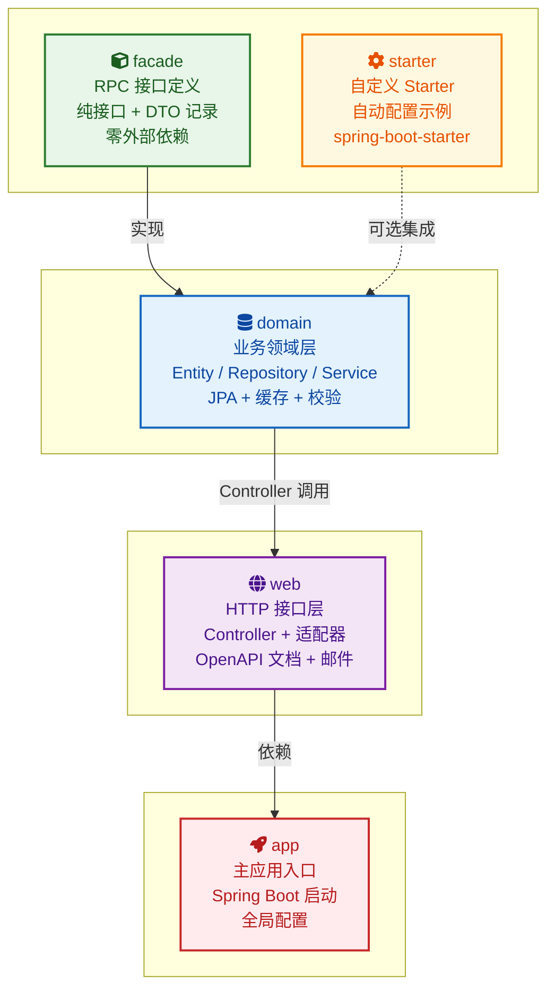

# Claude示例开发工程

<p align="center">
  <b>Spring Boot 3.5 多模块示例工程</b>
</p>

<p align="center">
  <a href="https://github.com/Ib3b/shopping-mall/actions/workflows/ci.yml">
    
  </a>
  <a href="https://github.com/Ib3b/shopping-mall/packages">
    
  </a>
  <a href="https://github.com/Ib3b/shopping-mall/releases">
    
  </a>
  
  
  
</p>

---

## 项目结构

```
shopping-mall/
├── facade/       # RPC 服务接口层（二方包，零依赖）
├── domain/       # 业务领域层（聚合所有业务代码）
├── starter/      # 自定义 Spring Boot Starter
├── web/          # HTTP 接口层（Controller + 基础设施适配器）
└── app/          # 主应用入口（配置文件 + 启动类）
```

### 模块依赖关系



### 模块职责

| 模块 | 职责 | 外部依赖 |
|:----:|------|----------|
| **facade** | RPC 接口 + DTO 定义，独立发布为二方包 | `jakarta.validation-api` |
| **domain** | Entity/Repository/Service、RpcService 实现、设计模式 | facade, JPA, cache, MapStruct |
| **starter** | Spring Boot Starter 自动配置（GreetingService 演示） | spring-boot-starter |
| **web** | Controller、全局异常处理、基础设施适配器（邮件） | domain, starter, spring-web, springdoc, spring-mail |
| **app** | 启动类、配置类（Async/Cache/Swagger） | web, starter |

### 内部分层（domain 模块）

```
common/entity/     → JPA 实体（User, Product, Order）
common/repository/ → Spring Data JPA Repository
common/dto/        → 领域 DTO（record）
common/exception/  → BusinessException

user/service/      → UserService
product/service/   → ProductService（库存、缓存逻辑）
order/service/     → OrderService（含乐观锁重试）、OrderDataAccessor
order/state/       → 状态模式（订单状态转换处理器）
order/event/       → 事件驱动（OrderCreatedEvent、OrderStatusChangedEvent）
order/port/        → 出站端口接口（NotificationSender）
domain/impl/       → RpcService 实现（防腐层适配器）
domain/mapper/     → MapStruct 映射器（领域 DTO ↔ facade DTO）
```

### 请求调用链

```
Controller                    (@RestController, web)
  ↓ 通过 RPC 接口调用
RpcServiceImpl               (防腐层，domain/impl/)
  ↓ MapStruct 转换 DTO
Domain Service               (业务逻辑，user|product|order/service/)
  ↓ Repository/Port 调用
JPA Repository / NotificationSender  (数据持久化 / 基础设施)
```

## 设计模式

| 模式 | 位置 | 说明 |
|:----:|------|------|
| 🏛️ 状态模式 | `order/state/` | 订单状态机，每个状态有独立 Handler |
| 📡 事件驱动 | `order/event/` | Spring `ApplicationEventPublisher` + `@Async` 监听器 |
| 🧱 防腐层 | `domain/impl/` | RpcService 隔离 facade DTO 与领域层 |
| 🔌 端口适配器 | `order/port/` | `NotificationSender` 接口，`MailNotificationAdapter` 实现 |
| 🔒 乐观锁重试 | `order/service/` | `@Version` + `TransactionTemplate` + 指数退避重试 |

### 并发控制方案

下单即扣库存的高并发场景提供了三种方案（当前使用方案一）：

| 方案 | 机制 | 读性能 | 写吞吐 | 适用场景 |
|:----:|------|:------:|:------:|----------|
| **① 乐观锁 + 重试** ✅ | `@Version` + 自动重试 3 次 | ★★★★★ | ★★★★ | 通用业务（冲突 &lt; 10%） |
| ② 悲观锁 | `SELECT ... FOR UPDATE` | ★★★ | ★★★ | 秒杀等高冲突 |
| ③ 原子 UPDATE | `UPDATE stock = stock - ? WHERE stock >= ?` | ★★★★★ | ★★★★★ | 纯数字扣减 |

## 功能特性

| 功能 | 说明 |
|:----:|------|
| 👤 用户管理 | 注册、查询、更新、删除 |
| 📦 商品管理 | CRUD、库存管理、分类查询、搜索、Caffeine 缓存 |
| 📑 订单管理 | 创建订单（乐观锁自动扣库存）、状态流转、取消恢复库存 |
| 📧 邮件服务 | 异步邮件通知（模拟/真实发送） |
| 📖 API 文档 | Swagger UI（/swagger-ui.html） |
| 🔧 自定义 Starter | 演示 Spring Boot Starter 自动配置 |
| 🗄️ 数据库 | SQLite 运行环境 / H2 测试环境 |
| 🔒 乐观锁重试 | 并发冲突自动检测 + 指数退避重试 |

## 快速开始

```bash
# 构建项目
mvn clean package

# 启动应用
cd app && mvn spring-boot:run

# 运行测试
mvn test

# 运行单个测试
mvn test -Dtest=UserServiceTest

# 性能测试（需先启动应用）
mvn gatling:test -pl app
```

## 运行要求

- JDK 25+
- Maven 3.6+

## 使用 GitHub Packages

```xml
<dependency>
  <groupId>io.github.ib3b</groupId>
  <artifactId>app</artifactId>
  <version>1.1.0</version>
</dependency>
```

## 访问地址

| 服务 | 地址 |
|------|------|
| API | http://localhost:8080 |
| Swagger UI | http://localhost:8080/swagger-ui.html |
| Actuator | http://localhost:8080/actuator/health |

## API 端点

<details>
<summary><b>👤 用户管理</b> <code>/api/users</code></summary>

| 方法 | 端点 | 说明 | 请求体 | 响应 |
|:----:|------|------|--------|------|
|  | `/api/users` | 创建用户 | `UserCreateRequest` | `UserDTO` |
|  | `/api/users` | 分页获取用户列表 | - | `Page<UserDTO>` |
|  | `/api/users/{id}` | 根据 ID 获取用户 | - | `UserDTO` |
|  | `/api/users/username/{username}` | 根据用户名获取用户 | - | `UserDTO` |
|  | `/api/users/{id}` | 更新用户 | `UserUpdateRequest` | `UserDTO` |
|  | `/api/users/{id}` | 删除用户 | - | 204 No Content |

</details>

<details>
<summary><b>📦 商品管理</b> <code>/api/products</code></summary>

| 方法 | 端点 | 说明 | 请求体 | 响应 |
|:----:|------|------|--------|------|
|  | `/api/products` | 创建商品 | `ProductCreateRequest` | `ProductDTO` |
|  | `/api/products` | 分页获取商品列表 | - | `Page<ProductDTO>` |
|  | `/api/products/{id}` | 根据 ID 获取商品 | - | `ProductDTO` |
|  | `/api/products/category/{category}` | 按分类查询商品 | - | `List<ProductDTO>` |
|  | `/api/products/search?keyword=` | 搜索商品 | - | `List<ProductDTO>` |
|  | `/api/products/in-stock` | 获取有库存商品 | - | `List<ProductDTO>` |
|  | `/api/products/{id}` | 更新商品 | `ProductUpdateRequest` | `ProductDTO` |
|  | `/api/products/{id}` | 删除商品 | - | 204 No Content |

</details>

<details>
<summary><b>📑 订单管理</b> <code>/api/orders</code></summary>

| 方法 | 端点 | 说明 | 请求体 | 响应 |
|:----:|------|------|--------|------|
|  | `/api/orders` | 创建订单（乐观锁扣库存） | `OrderCreateRequest` | `OrderDTO` |
|  | `/api/orders` | 分页获取订单列表 | - | `Page<OrderDTO>` |
|  | `/api/orders/{id}` | 根据 ID 获取订单 | - | `OrderDTO` |
|  | `/api/orders/user/{userId}` | 获取用户订单列表 | - | `List<OrderDTO>` |
|  | `/api/orders/user/{userId}/count` | 获取用户订单数量 | - | `Long` |
|  | `/api/orders/status/{status}` | 按状态查询订单 | - | `List<OrderDTO>` |
|  | `/api/orders/{id}/status?status=` | 更新订单状态 | - | `OrderDTO` |
|  | `/api/orders/{id}/cancel` | 取消订单（恢复库存） | - | `OrderDTO` |

</details>

<details>
<summary><b>👋 问候服务</b> <code>/api/greeting</code></summary>

| 方法 | 端点 | 说明 | 参数 | 响应 |
|:----:|------|------|------|------|
|  | `/api/greeting` | 问候接口（Starter 演示） | `name` (可选) | `String` |

</details>

---

<p align="center"><i>Made with ❤️ using Spring Boot</i></p>
