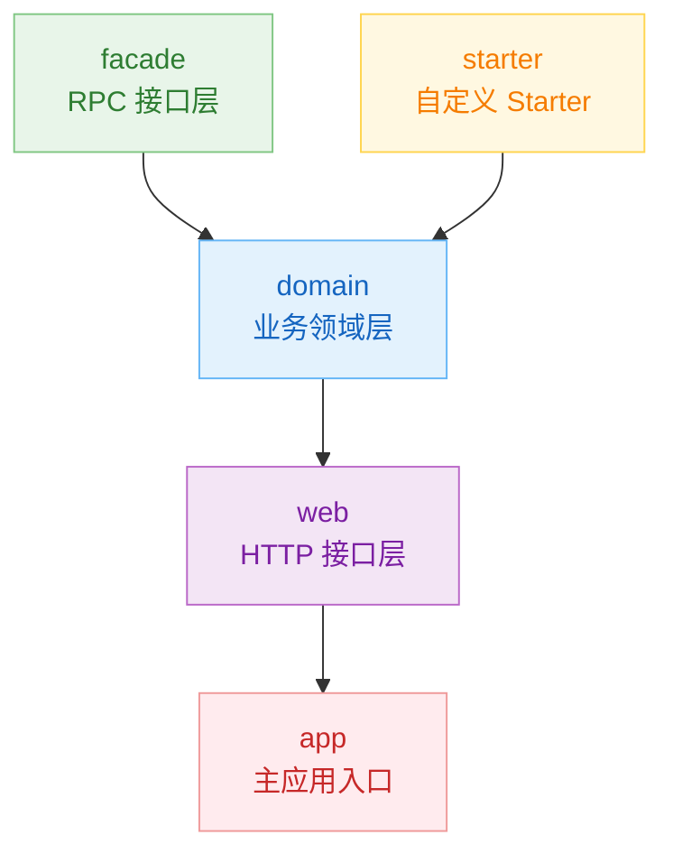

# Claude示例开发工程

<p align="center">
  <b>Spring Boot 3.5 多模块示例工程</b>
</p>

<p align="center">
  <a href="https://github.com/Ib3b/shopping-mall/actions/workflows/ci.yml">
    
  </a>
  <a href="https://github.com/Ib3b/shopping-mall/packages">
    
  </a>
  <a href="https://github.com/Ib3b/shopping-mall/releases">
    
  </a>
  
  
  
</p>

---

## 项目结构

```
shopping-mall/
├── facade/       # RPC 服务接口层（二方包，无依赖）
├── domain/       # 业务领域层（聚合所有业务代码）
├── starter/      # 自定义 Spring Boot Starter
├── web/          # HTTP 接口层（Controller）
└── app/          # 主应用入口
```

### 模块依赖关系



### 模块职责

| 模块 | 职责 | 依赖 |
|:----:|------|------|
| **facade** | RPC 接口定义层，纯接口和 DTO，可独立发布为二方包 | 无 |
| **domain** | 业务领域层，包含 Entity、Repository、Service 和 RpcService 实现 | facade |
| **starter** | 自定义 Spring Boot Starter 示例 | spring-boot-starter |
| **web** | HTTP 接口层，包含所有 Controller | domain, starter |
| **app** | 主应用入口，启动配置 | web, starter |

## 功能特性

| 功能 | 说明 |
|:----:|------|
| 👤 用户管理 | 注册、查询、更新、删除 |
| 📦 商品管理 | CRUD、库存管理、分类查询、搜索、缓存 |
| 📑 订单管理 | 创建订单、自动扣库存、状态流转、取消恢复库存 |
| 📧 邮件服务 | 异步模拟发送 |
| 📖 API 文档 | Swagger UI |
| 🔧 自定义 Starter | 演示 Spring Boot Starter 开发 |

## 快速开始

```bash
# 构建项目
mvn clean package

# 启动应用
cd app && mvn spring-boot:run

# 运行测试
mvn test
```

## 使用 GitHub Packages

```xml
<dependency>
  <groupId>io.github.ib3b</groupId>
  <artifactId>app</artifactId>
  <version>1.0.0</version>
</dependency>
```

## 访问地址

| 服务 | 地址 |
|------|------|
| API | http://localhost:8080 |
| Swagger UI | http://localhost:8080/swagger-ui.html |

## API 端点

<details>
<summary><b>👤 用户管理</b> <code>/api/users</code></summary>

| 方法 | 端点 | 说明 | 请求体 | 响应 |
|:----:|------|------|--------|------|
|  | `/api/users` | 创建用户 | `UserCreateRequest` | `UserDTO` |
|  | `/api/users` | 分页获取用户列表 | - | `Page<UserResponse>` |
|  | `/api/users/{id}` | 根据 ID 获取用户 | - | `UserDTO` |
|  | `/api/users/username/{username}` | 根据用户名获取用户 | - | `UserDTO` |
|  | `/api/users/{id}` | 更新用户 | `UserUpdateRequest` | `UserDTO` |
|  | `/api/users/{id}` | 删除用户 | - | 204 No Content |

</details>

<details>
<summary><b>📦 商品管理</b> <code>/api/products</code></summary>

| 方法 | 端点 | 说明 | 请求体 | 响应 |
|:----:|------|------|--------|------|
|  | `/api/products` | 创建商品 | `ProductCreateRequest` | `ProductDTO` |
|  | `/api/products` | 分页获取商品列表 | - | `Page<ProductResponse>` |
|  | `/api/products/{id}` | 根据 ID 获取商品 | - | `ProductDTO` |
|  | `/api/products/category/{category}` | 按分类查询商品 | - | `List<ProductDTO>` |
|  | `/api/products/search?keyword=` | 搜索商品 | - | `List<ProductDTO>` |
|  | `/api/products/in-stock` | 获取有库存商品 | - | `List<ProductDTO>` |
|  | `/api/products/{id}` | 更新商品 | `ProductUpdateRequest` | `ProductDTO` |
|  | `/api/products/{id}` | 删除商品 | - | 204 No Content |

</details>

<details>
<summary><b>📑 订单管理</b> <code>/api/orders</code></summary>

| 方法 | 端点 | 说明 | 请求体 | 响应 |
|:----:|------|------|--------|------|
|  | `/api/orders` | 创建订单（自动扣库存） | `OrderCreateRequest` | `OrderDTO` |
|  | `/api/orders` | 分页获取订单列表 | - | `Page<OrderResponse>` |
|  | `/api/orders/{id}` | 根据 ID 获取订单 | - | `OrderDTO` |
|  | `/api/orders/user/{userId}` | 获取用户订单列表 | - | `List<OrderDTO>` |
|  | `/api/orders/user/{userId}/count` | 获取用户订单数量 | - | `Long` |
|  | `/api/orders/status/{status}` | 按状态查询订单 | - | `List<OrderDTO>` |
|  | `/api/orders/{id}/status?status=` | 更新订单状态 | - | `OrderDTO` |
|  | `/api/orders/{id}/cancel` | 取消订单（恢复库存） | - | `OrderDTO` |

</details>

<details>
<summary><b>👋 问候服务</b> <code>/api/greeting</code></summary>

| 方法 | 端点 | 说明 | 参数 | 响应 |
|:----:|------|------|------|------|
|  | `/api/greeting` | 问候接口（Starter 演示） | `name` (可选) | `String` |

</details>

## 运行要求

- JDK 21+
- Maven 3.6+

---

<p align="center"><i>Made with ❤️ using Spring Boot</i></p>